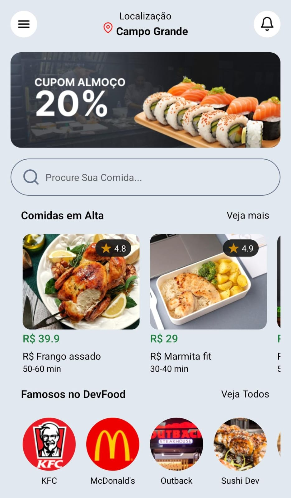

<h1 align="center" style="font-weight: bold;">DevFood 💻</h1>

<p align="center">
 <a href="#tech">Technologies</a> • 
 <a href="#started">Getting Started</a> • 
  <a href="#colab">Collaborators</a> •
</p>

<p align="center">
    <b>This project is a simple static page, with a layout based on Ifood, which consumes a JSON server, to study some React Native practices</b>
</p>

<h2 id="layout">🎨 Layout</h2>

<p align="left">
    
</p>

<h2 id="technologies">💻 Technologies</h2>

- React Native v51
- Expo v51
- React v18
- TailwindCSS v4
- JSON-Server v1

<h2 id="started">🚀 Getting started</h2>

<h3>Pre-requisites</h3>

- [NodeJS](nodejs.org)

<h3>Cloning</h3>

How to clone project

```bash
git clone https://github.com/oN0V41S/DevFood.git
```

<h3>Run Project</h3>

install dependencies

```bash
cd DevFood
npm install
```

run JSON-sever on root of project
```bash
npx json-server db.json
```

run project in expo
```bash
npx expo start
```

Now debug the project on mobile with emulator or a device.

<h2 id="colab">🤝 Collaborators</h2>

This project is based on tutorial created by [Criar App Delivery com React Native + TailwindCSS - Sujeito Progamador](https://youtu.be/aABUs_L4AZg)

<table>
  <tr>
    <td align="center">
      <a href="https://github.com/devfraga">
        <br>
        <sub>
          <b>Matheus Fraga</b>
        </sub>
      </a>
    </td>
      <td align="center">
      <a href="https://github.com/oN0V41S">
        <br>
        <sub>
          <b>Rafael Novais</b>
        </sub>
      </a>
    </td>
  </tr>
</table>
